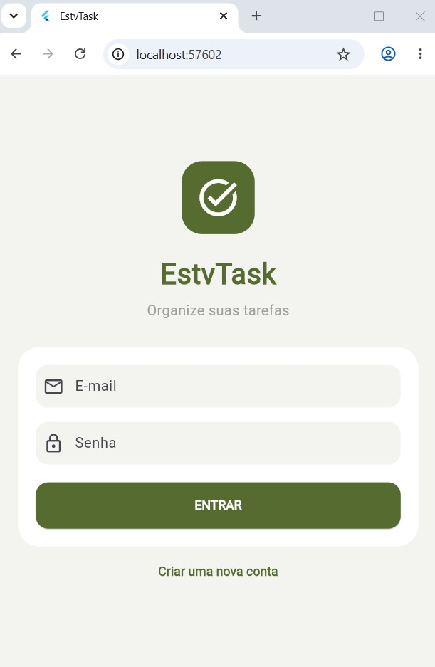
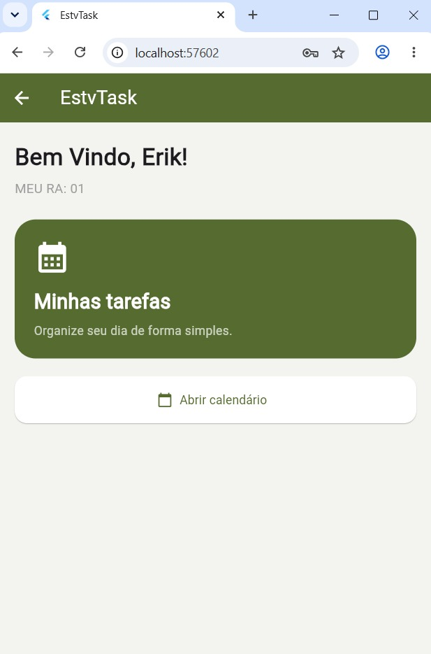
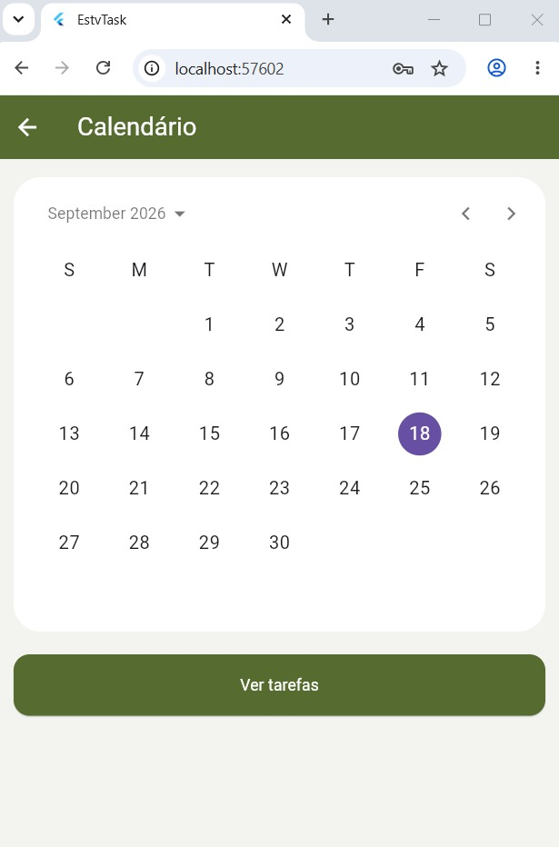
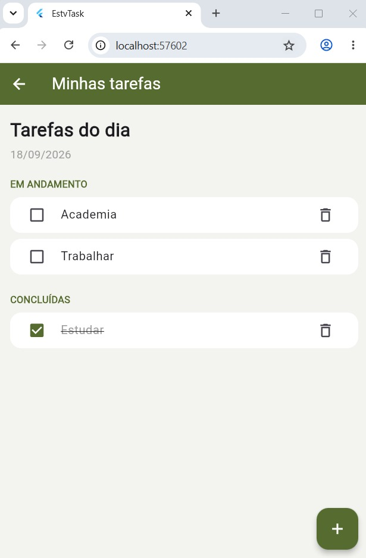

<h1>EstvTask</h1>

Projeto acadêmico desenvolvido em <strong>Flutter</strong> para a disciplina
<strong>Desenvolvimento para Dispositivos Móveis</strong>, da
<strong>Universidade de Uberaba (UNIUBE)</strong>.

A aplicação permite <strong>realizar cadastro e login, visualizar um calendário,
adicionar tarefas, remover tarefas e marcar tarefas como concluídas</strong>.

<h2>Aplicação</h2>

<table>
  <tr>
    <td>
      
    </td>
    <td>
      
    </td>
    <td>
      
    </td>
    <td>
      
    </td>
  </tr>
</table>

<h2>Execução</h2>

O projeto foi desenvolvido e testado utilizando <strong>Flutter</strong>.

<pre>
flutter run -d chrome
</pre>

<h2>Tecnologias utilizadas</h2>

<ul>
  <li><strong>Flutter</strong></li>
  <li><strong>Dart</strong></li>
  <li><strong>Material Design</strong></li>
  <li><strong>CalendarDatePicker</strong></li>
  <li><strong>ShowDialog</strong></li>
  <li><strong>Git e GitHub</strong></li>
</ul>

<h2>Estrutura do projeto</h2>

<pre>
flutter_tasks/
│
├── android/
├── lib/
│   └── main.dart
│
├── test/
│   └── widget_test.dart
│
├── pubspec.yaml
├── pubspec.lock
├── analysis_options.yaml
└── README.md
</pre>

<h2>Como executar</h2>

Entre na pasta do projeto:

<pre>
cd C:\src\flutter_tasks
</pre>

Instale as dependências:

<pre>
flutter pub get
</pre>

Execute a aplicação:

<pre>
flutter run -d chrome
</pre>

<h2>Funcionalidades</h2>

<ul>
  <li>Cadastro de usuário</li>
  <li>Login</li>
  <li>Visualização do calendário</li>
  <li>Seleção de datas</li>
  <li>Adicionar tarefas</li>
  <li>Remover tarefas</li>
  <li>Marcar tarefas como concluídas</li>
  <li>Retornar tarefas para pendentes</li>
  <li>Organização das tarefas por data</li>
  <li>Separação entre tarefas pendentes e concluídas</li>
  <li>Ordenação alfabética das tarefas</li>
  <li>Interface responsiva</li>
  <li>Armazenamento das tarefas durante a execução da aplicação</li>
</ul>
